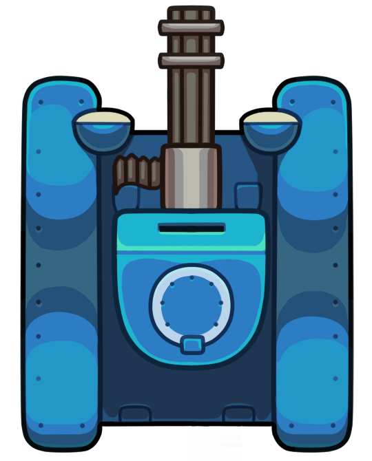

# Debugger Game

**Author: Miguel Uzcátegui**

## Overview

You are a turret keeping guard of a sweet system. Suddenly, bugs start trying to invade and infect it.

You need to start shooting them to save your system. You are its only hope! As long as you are alive your system will survive. Start typing and don't let those bugs get you.

## Gameplay

- Use your keyboard to type the word on top of the bugs as fast as you can

  
### Third party applications

- Phaser 3 framework
- JavaScript ES6
- HTML5 / CSS3
- Webpack
- Babel
- Random Words APi

## Main Menu

The first thing you will see is a loading screen with a progress bar. This will load all necessary files and assets for the game. Then you will see the main menu scene with 3 buttons that lead you to other 3 different scenes

 

## Scenes

- **Game Scene**: Here is where the game take place. Keep typing to survive
- **Instructions**: Here you can read the game instructions on how to play
- **Leaderboard**: Here you can see the top 5 player with their names and scores

## Game Characters
### Player

  

  The player is a turret that aims and shoots after you type the word on top of a bug

### Bugs

  

  The main enemy in the game are bugs. They have a word associated with them, you need to type it to shoot each individual bug. They will apper in waves of 5 every time you shoot them all 

## Health 

**Player:** When a bug touches the player the game is over

**Bugs:** Once the player types the word on top of the bug with no mistakes, it explodes and dissapers

## Scoring
  The length of the word of each of the bugs the player shoot is added to the player score