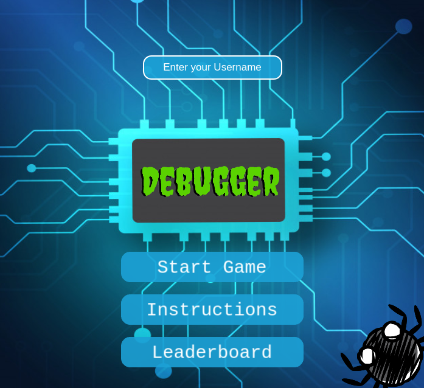

# Debugger

> This is a shooter game. Bugs are trying to infest your system and 
> you need to stop them using your keyboard to type the word on top of them

## Built With

- Javascript ES6
- Phaser 3
- WebPack
- Words and Scores APIs
- HTML / CSS
- VS Code

## How to Play

When you first open the game, you will see a loading screen. Once it finishes loading all the assets, it will show you the main menu of the game.

 

To Play you will need a keyboard and good reflexes. You first need to enter your name in the field on top. Then click on the "Start Game" button, the game will begin immediately, be ready!


Once the game has begun, bugs will try to catch you (you are the blue turret at the bottom) to stop them, type the word on top of them with no mistakes. If you mistype one letter you will have to start over with that word. 

- The score increases when you shoot a bug
- The lengthier the word the more points you get
- Once you shoot all bugs, more bugs are going to spawn immediately
- The more waves of bugs you survive the more lengthier the words become (more points!)
- If a bug touches you, the game is over and you will see the Leaderboard

## Live Demo

> To play this game online go [here](https://miguelus373.github.io/Debugger-Game/)

## How to Install

> If you want to have this game on your local machine just follow these simple steps

### Pre-requisites

To set up this project locally we will need:
- A bash terminal
- Node Package Manager (npm) installed in our system

### Setup

- Install npm in your system. Read the [Documentation](https://nodejs.org/en/download/package-manager/)
- Open your bash terminal and download this repo using this commad:
    ``` 
   git clone https://github.com/Miguelus373/Debugger-Game.git
    ``` 
- On your terminal, go into the Debugger-Game folder with:
    ``` 
   cd Debugger-Game
    ``` 
- Now run this commad to install all the dependencies:
    ``` 
   npm install
    ``` 
- Once it finishes downloading, run a local server using:
    ``` 
   npm start
    ``` 
- The setup is all done. You can now go to your [Local Server](http://localhost:3000/) and play

## Author  

👤 **Miguel Uzcátegui**

- Github: [@miguelus373](https://github.com/miguelus373)
- Linkedin: [Miguel-Uzcátegui](https://www.linkedin.com/in/miguelus/)

## Acknowledgment

This game is inspire by the [ztype](https://zty.pe/) typing game

All the assets for this game come from [OpenGameArt](https://opengameart.org/)

The bug words come from this amazing [word API](https://github.com/RazorSh4rk/random-word-api)


## 🤝 Contributing

Contributions, issues and feature requests are welcome!. Feel free to check the [issues page](https://github.com/Miguelus373/Debugger-Game/issues).

## Show your support

Give a ⭐️ if you like this project!

## 📝 License
This project is [MIT](https://github.com/Miguelus373/Debugger-Game/blob/develop/LICENSE) licensed.
